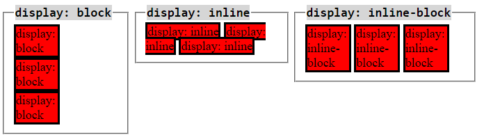

# This is the second part of the CSS guide. In this part, we will cover the following topics:

## 📝 Topics
1. CSS Box Model
2. CSS Display Property
3. CSS Position Property
4. CSS Float Property
5. CSS Flexbox
6. CSS Grid

---

### 1. 📦 CSS Box Model
- The CSS box model is a box that wraps around every HTML element. It consists of: margins, borders, padding, and the actual content.

---

### 2. 🖥 CSS Display Propert
- The `display` property specifies the type of box used for an HTML element. There are several display values, but the most common are:
  - `block`: Displays an element as a block element (like a paragraph).
  - `inline`: Displays an element as an inline element (like a span).
  - `inline-block`: Displays an element as an inline-level block container.
  

---

### 3. 📏 CSS Position Propert
- The `position` property specifies the type of positioning method used for an element. There are five different position values:
  - `static`: The default value. Elements render in order, as they appear in the document flow.
  - `relative`: The element is positioned relative to its normal position.
  - `absolute`: The element is positioned relative to its first positioned (not static) ancestor element.
  - `fixed`: The element is positioned relative to the browser window.
  - `sticky`: The element is positioned based on the user's scroll position.

[More about CSS Position Property](https://dillionmegida.com/p/static-relative-absolute-fixed-sticky-positions/)

---

### 4. 🌊 CSS Float Propert
- The `float` property specifies whether an element should float to the left, right, or not at all. It is commonly used to create multi-column layouts.

---

### 5. 🚀 CSS Flexbox
- Flexbox is a layout model that allows you to design complex layouts more easily. It provides an efficient way to lay out, align, and distribute space among items in a container, even when their size is unknown and/or dynamic.

---

### 6. 📐 CSS Grid
- CSS Grid Layout is a two-dimensional layout system for the web. It lets you lay out items in rows and columns, and it provides a way to create grid structures that are more complex than what Flexbox can handle.

---

# The core difference between Flexbox and Grid
- Flexbox is a one-dimensional layout method for laying out items in rows or columns. Items flex to fill additional space and shrink to fit into smaller spaces.
- Grid is a two-dimensional layout method for laying out items in rows and columns. You can use it to create complex layouts that are not possible with Flexbox.

# is flex or grid good for responsive design?
It is ideal for creating responsive layouts where items need to flex and adapt to different screen sizes.
but Grid is more suitable for creating complex layouts with rows and columns and It is ideal for creating grid-based designs where items need to be placed in specific locations.

## 📚 Resources

- [CSS Box Model](https://www.w3schools.com/css/css_boxmodel.asp)
- [CSS Display Property](https://www.w3schools.com/cssref/pr_class_display.asp
- [CSS Position Property](https://www.w3schools.com/cssref/pr_class_position.asp)
- [CSS Float Property](https://www.w3schools.com/cssref/pr_class_float.asp)
- [CSS Flexbox](https://www.w3schools.com/css/css3_flexbox.asp)
- [CSS Grid](https://www.w3schools.com/css/css_grid.asp)
- [Flexbox vs Grid](https://www.youtube.com/watch?v=hs3piaN4b5I)
- [CSS Position](https://blog.hubspot.com/website/css-position)

